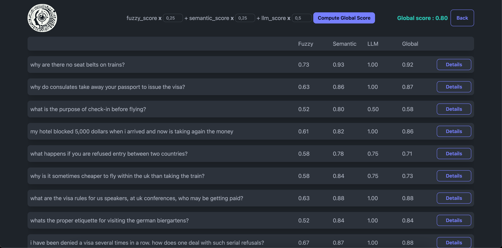

<div align="center">
  <h1>RAG EVALUATION WEB APP</h1>
</div>

This web application provides a user-friendly interface to evaluate the performance and quality of Retrieval-Augmented Generation (RAG) systems. By simply dragging and dropping your RAG application results.

<p align="center"></p>

## Prerequisites

Before you begin, ensure you have the following installed on your machine:

- **Node.js and npm:**  
- **Python 3:**  

## Environment Configuration

### Back-End env vars

1. Duplicate the example environment file:
   ```bash
   cp back/.env.example back/.env
   ```
   
2. Open the `back/.env` file in a text editor and fill in the required values. For example:
   ```
    API_PORT=8000
    GROK_API_KEY=xxxxxxxxxxxx
    GROK_LLM_MODEL=llama3-8b-8192
    TEXT_EMBEDDING_MODEL=BAAI/bge-small-en-v1.5
    PYTORCH_DEVICE=mps
   ```

### Front-End env vars

1. Duplicate the example environment file:
   ```bash
   cp front/.env.example back/.env
   ```
   
2. Open the `front/.env` file in a text editor and fill in the required values. For example:
   ```
    VITE_API_URL=http://127.0.0.1:8000
   ```

   Make sure to adjust these values based on your setup.

## Installation

### Back-End Setup

1. Navigate to the `back` directory:
   ```bash
   cd back
   ```
   
2. Install Python dependencies:
   ```bash
   pip install -r requirements.txt
   ```
   
4. Start the back-end server:
   ```bash
   python -m app.server
   ```
   
   The back-end server should now be running at `http://127.0.0.1:8000` (or the port specified in `.env`).

### Front-End Setup

1. Navigate to the `front` directory:
   ```bash
   cd front
   ```
   
2. Install Node.js dependencies:
   ```bash
   npm install
   ```
   
3. Start the development server:
   ```bash
   npm run dev
   ```
   
   The front-end should now be accessible at `http://localhost:5173`.
